# Core Communication Collaboration Portal (C3PO) Overview

#### Summary:  
This document contains information on the C3PO application.  3CPO is a generic project management and communication 
application that supports multiple users via a central server.  The application handles both project requirements and 
bugs, provides scheduling assistance by way of sprints, and allows users to communicate in real time using a chat 
feature.  

#### Contents:
This document is divided into two major sections; User Guide and Development Guide.  The User Guide contains user 
information and instructions that orient a new user to the system capabilities and use.  The Development Guide
contains information for system deveopers who want to understand and modify the internals of the application.  

## User Guide

---------------

### Screen Layout

C3PO uses a single page layout with various pop up (modal) dialogs and information screens.  The user never leaves 
the main page however.  A sample main page follows:

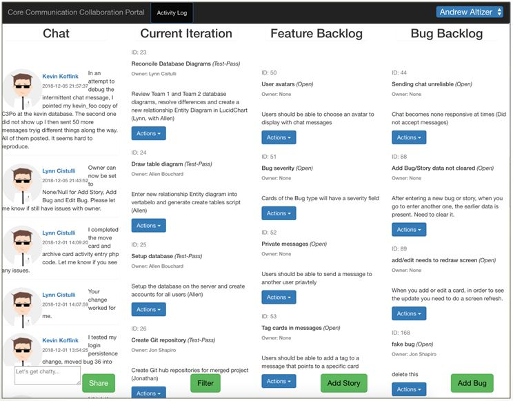

Note that the screen is divided into four columns.  From left to right these are:
- The Chat Function
- The Current Iteration Function
- The Feature-Backlog Function
- The Bug-Backlog Function

Each of these will be discussed below.

### Login

Before a user can utilize the various 3CPO functions s/he must log in.  Users self-identify so that C3PO can track 
their actions and identify who is talking via chat.  User identification is based on the honor system, although the 
user list is populated from the database.  The login drop down is located in the upper right of the main screen. 
The current users are supported:

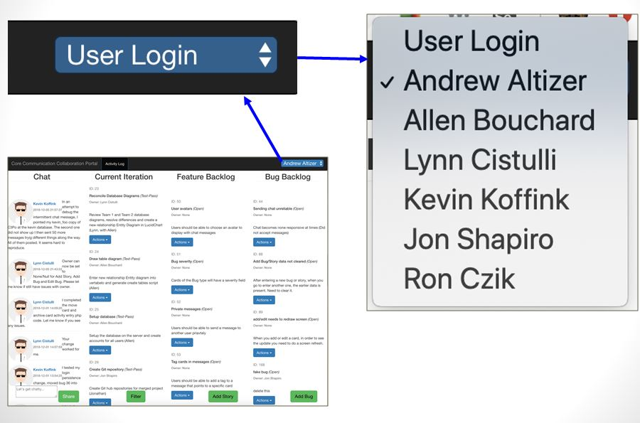

### Chat Function

Chat works by the user entering text in the lower left corner 'chat box' (pre-filled with "lets get chatty").  When
the user is satisfied with their message they publish it to other users by entering the 'Share' button.  The new chat 
message is appended to the top of the chat column. 

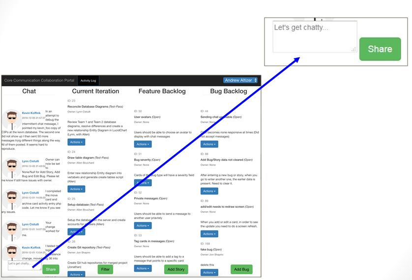

### Current Iteration (Sprint Management) Function, Feature and Bug Entry

One of the main functions of C3PO is to enable users to manage (document and track) a set of product features and bugs 
found in development, over a given development sprint.  To this end the remaining three columns of the main screen are
used to track active items in the current iteration, to enter new feature requests to track, and the enter new bug 
reports to track.  Bug and Feature entry are located to the right of the Current Iteration column as the 'backlog' of 
un-done items is on the right, while the active ones in the Current Iteration are center screen, and thus near the chat 
column which may be used to talk among users about them.  

A bug or a feature (also commonly called a story) is first entered using a modal dialog brought up by using either the
'Add Story' or 'Add Bug' buttons.  The dialogs are the same, but the data is entered into different internal tables so
that as items are moved to and from the Current Iteration they return to the appropriate column (Feature or Bug).    

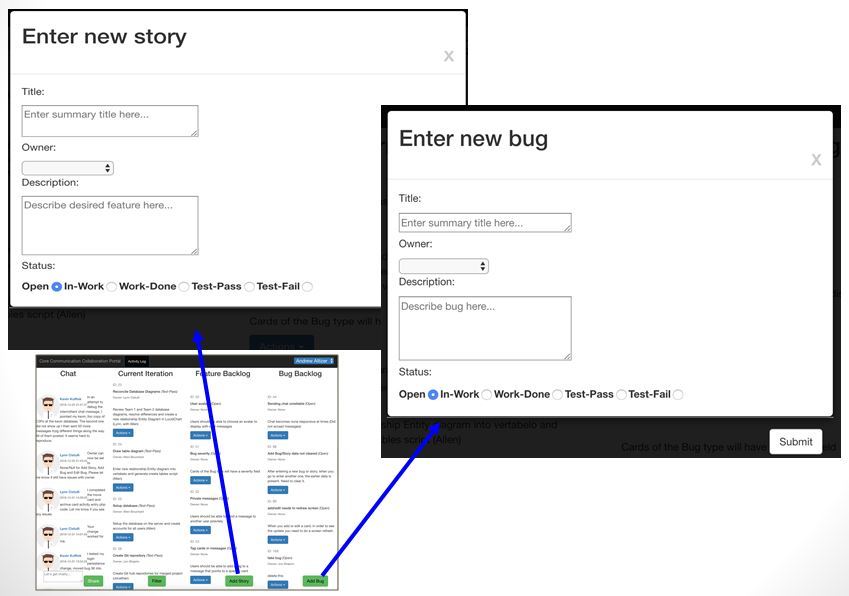
  
Note that a bug or story does not need to initially have an owner (it can just be reported for a future sprint).  The 
presumed use would be to choose which bugs and features should be addressed by the current sprint, move them to the 
current iteration, assign an owner (or have owners self select), mark the status as 'In-Work', fix the bug or implement
the feature, then mark the item as 'Work-Done'.  Later an SQA evaluation would confirm that the item was complete and 
it would be marked as 'Test-Pass', or alternately, 'Test-Fail' if not.  These paths are depicted in the following 
sequence diagrams.

The first half of a bug or feature lifecycle is to have it reported.  This is depicted below:

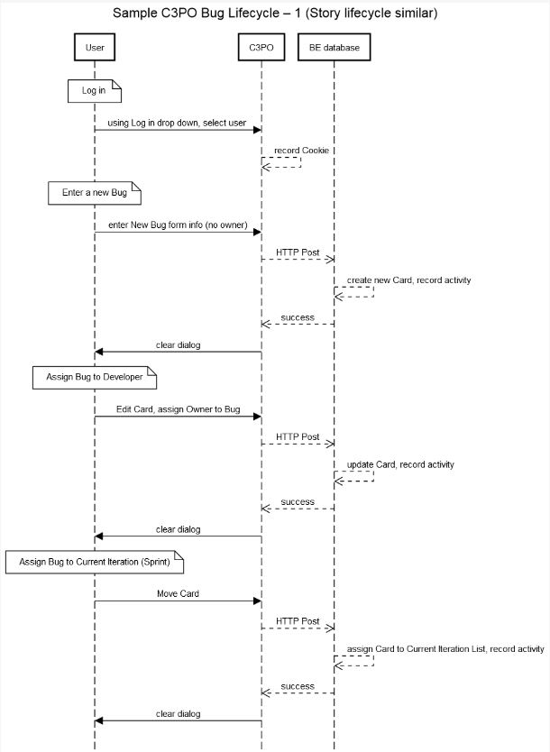

The second half of a bug or feature lifecycle is to have it addressed.  This is depicted below:

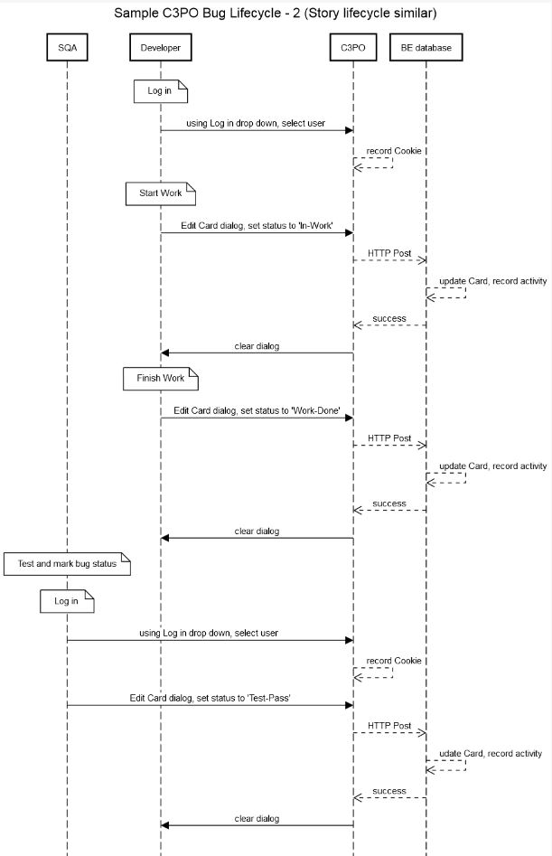

Bugs and Features (Stories) are moved to (and from) the Current Iteration column by using the drop down 'Action' menu 
'Move' Function that is attached to each Bug or Story.  

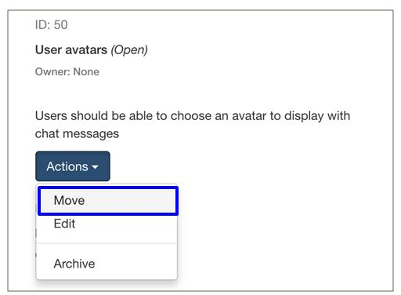

The other functions available from the 'Action' menu for each item are to 'Edit' it or to 'Archive' it.  Editing is how
a user changes the owner and state, although all fields can be modified (i.e., the title and description can also be
updated).  Archive is very much a delete function, in that the bug or story can no longer be seen, although it
is still in the database there is currently no means to retrieve and display archived items.  

### Filter Function

To provide a means to effectively manage the items in the Current Iteration, a 'Filter' function is provided that 
allows the set of items to be filtered by their work status.  The current set of work status is {Open, In-Work, 
Work-Done, Test-Pass and Test-Fail}.  The items that match the filter are displayed, and those that do not are hidden.
A 'Show All' selection is provided to disable filtering.  

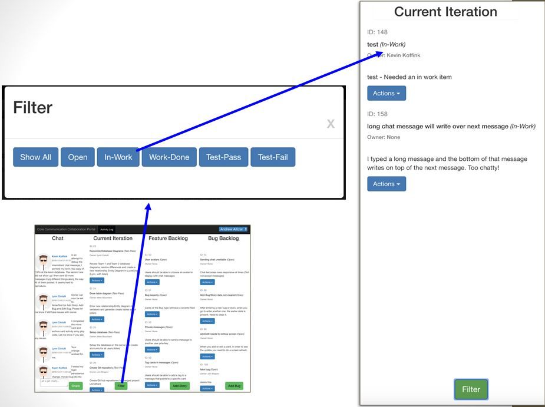

### Activity Function

Each operation performed on the database is tracked.  Thus each 'add bug', 'add story', 'enter chat message' event is
recorded in a log.  The log uses the self identified login user.  The event list can be reviewed using the 'Activity 
Log' button in the top of the screen.  

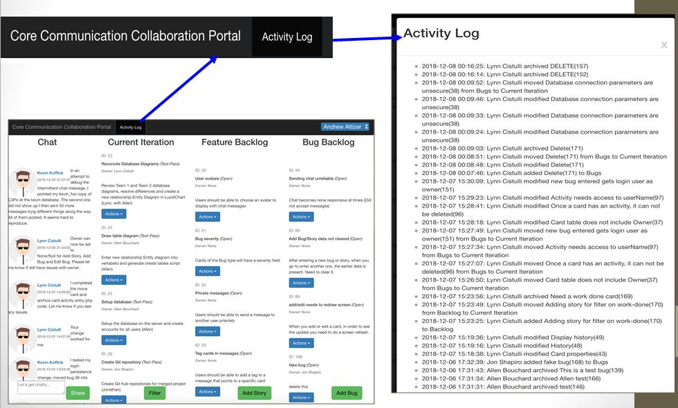

## Development Guide

This section outlines the technologies used to implement the application, and how to install them on a machine for
development.  
 
### Internals Overview

The general architecture of C3PO is depicted in the following diagram:

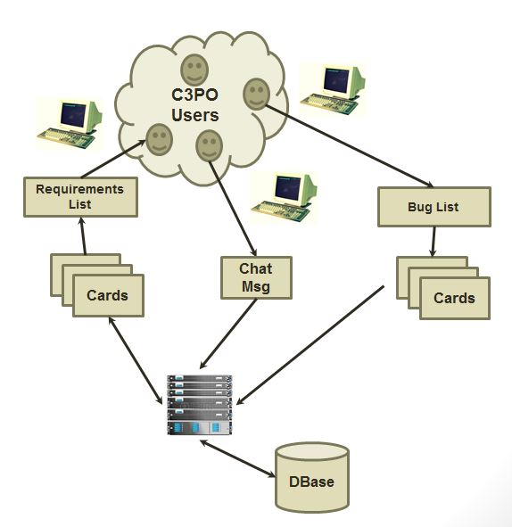

The key features to note are:
- That data is kept in a central store
- That access if via a web browser
- That Users enter and maintain items in a database called Cards
- That each Card stores a bug or a feature request
- That Card lists display active work, open bugs and features
- That Chat messages are also stored in a database
- And that chat updates are shown in real time

C3PO is built as a web based service invoked from a web page.  As a web page both HTML and JavaScript are used at the 
very front end.  Web page updates are requested and posted using the AJAX (Asynchronous JavaScript And XML) JavaScript 
facility.  This 'very front end' passes control to a set of PHP files that receives the requests, queries the back end 
database, and sends back a response which AJAX uses to update the page.  Note that the back end is 'stateless' and 
that all state is kept at the front end.  Primarily this consists of a user login 'cookie'.  

These interactions are depicted below:

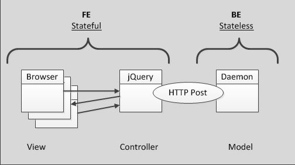

The database 'back end' is mySQL.  Scripts to create the database are committed along with the code.  The current 
database logical model is as follows:

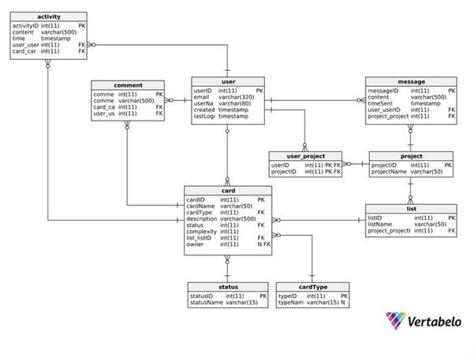

### Installing Tools On Windows

Windows installation of PHP followed the general instructions at:
https://docs.moodle.org/35/en/Manual_install_on_Windows_7_with_Apache_and_MySQL

Note: it is important to be consistent in the downloads.  There are various environments supported, Windows 64 and 32
bit, and 'Thread Safe' and 'not Thread Safe'.  The above link advised to use 'Thread Safe' and Win 32 environments (the 
Win 64 being more experimental).  Besides that, it is also important to use a tool chain that is consistent for the
Microsoft Visual Studio redistributable libraries.  Several of the (C++) applications are built using these but you 
do not need Visual Studio installed, rather you can simply install the 'redistributable library'.  

The tool chains selected below all use the VC15 libraries, and win32, Thread Safe, builds.

In addition to these tools, the team is using JetBrains PhpStorm IDE, and of course git and GitHub.  There are notes
below for configuring these tools also.  

#### PHP

Download the PHP interpreter from https://windows.php.net/download.  Note that this is only the first of several file 
downloads that need to be combined.  In total there are 3 for PHP, plus Apache.  To ease modification download the zip 
files to a working directory, say php_v7_downloads, and unzip them there, make modifications, and later copy all the 
files to the final 'deploy' location (C:/php, see below).

- Download and unzip the PHP interpreter, use version 7.2.11 (for VC15 compatibility).  The file is 
```VC15 x86 Thread Safe (2018-Oct-10 19:16:08)```.  

For debugging support two other sets of files needed to be added to this.  

- Download and unzip the compatible 'Debug Pack' from windows.php.net/download (it is just below the interpreter file
listed above).
 
- For PhpStorm debug you also need an 'xdebug' debugger.  Download this from https://xdebug.org, select Xdebug 2.6.1
(which is a released version using PHP 7.2, VC15 TS (32 bit)).  Unzip it in the same php_v7_downloads directory as the
other files.

After downloading and unzipping the files there are a few manual tweaking steps.
1. copy the  ‘php.ini-development’ file to ‘php.ini’
2. edit the php.ini file (for debugger support), add the following:

```
[Xdebug]
zend_extension="C:/php/php_xdebug.dll"
xdebug.remote_enable=1
xdebug.remote_port="9000"
```

also set:
```
doc_root = c:\Apache24\htdocs 
```

3. deploy files to C:/php (lowercase)

#### Apache

Apache is needed by PHP.  Download from https://www.apachelounge.com/download.  Use the [Apache VC15 Binary] 
httpd-2.4.37-win32-VC15.zip.  Copy or move files to C:/Apache24.  

To test out the installation first start the server by opening a command window (cmd.exe), cd C:/Apache24/bin, 
enter httpd.exe.  Note that you need to leave this window open (or set up Apache as a background service).  To exit 
the server type control-C.  

After starting the server bring up a browser and type http://localhost.  If all is well you should see “It Works!” 

#### PhpStorm

PhpStorm is an IDE by JetBrains.  Find it at https://www.jetbrains.com.  The program supports PHP and HTML development
and integrates seamlessly with git and GitHub.  It does not however come with its own PHP interpreter, which must be
installed as noted above, and it also requires an external script debugger (Xdebug), installed as noted above, and it
needs an external git installed also.  For unit testing notes see the following: 

- https://www.jetbrains.com/help/phpstorm/enabling-php-unit-support.html
- https://www.jetbrains.com/help/phpstorm/configuring-xdebug.html

PhpStorm needs git installed, and this is outside of the scope of this README.  However one example would be the 
binaries of cygwin https://cygwin.com, which include git.  In this case (and perhaps others) PhpStorm needs to be 
informed of the path to git.  This is done via File --> Settings --> Version Control --> Git --> fill in the box, 
an example could be ```C:\cygwin64\bin\git.exe```.  It is also recommended to specify this path in the Windows Path 
system environment variable, i.e., ```Path = C:\cygwin64\bin;C:\cygwin64``` (this will require a system restart to
take effect), otherwise you may get an error when trying to connect with GitHub similar to 'can not open shared 
object file'.  See
https://stackoverflow.com/questions/27566999/git-with-intellij-idea-could-not-read-from-remote-repository for more.

If you use https for the git connection, set the remote repository to this repository by selecting VCS --> Git --> 
Remotes and entering '+' and then origin https://github.com/cs673team1/cs673team1_fe.git in the pop up box.

It is also useful to tell PhpStorm that GitHub is being used.  Go to Settings --> Version Control --> GitHub and 'get a
token' by selecting the '+', enter your user name and password.  Now PhpStorm Git Push command will push back to GitHub
without asking for additional login information each time. 

Note that to make the Version Control window appear (default location is at the bottom of the PhpStorm IDE) it may
be necessary to enter 'Alt + 9'.  

PHPUnit can be used for unit testing of class files.  See installation and use notes at 
https://www.jetbrains.com/help/phpstorm/enabling-php-unit-support.html for more details.  Briefly, install the 
phpunit.phar (PHP Archive file) on the previously created php binary directory (C:\php).  The .phar file can be 
obtained from https://phar.phpunit.de, instructions for PHPUnit 7 can be found at 
https://phpunit.de/getting-started/phpunit-7.html, which suggests the following to install:

```
wget -O phpunit https://phar.phpunit.de/phpunit-7.phar
chmod +x phpunit
./phpunit --version
PHPUnit 7.0.0 by Sebastian Bergmann and contributors.
```

Note: To use this the php directory must be C:\bin not C:\php.


